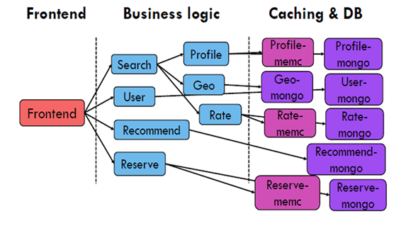

# Hotel Reservation

A hotel reservation microservice, built with Go and gRPC, based on https://github.com/harlow/go-micro-services.

Supported actions: 

* Get profile and rates of nearby hotels available during given time periods
* Recommend hotels based on user provided metrics
* Place reservations



## Preqreqs

#### Environmental checklist🧾

| Configuration item | Specific configuration |
| :----------------: | :--------------------: |
|         OS         |        centos7         |
|     Kubernetes     |         v1.18+         |
|    operator-sdk    |        v1.18.0         |
|         go         |         1.17.7         |

Have Installed the nfs-client-provisioner,it will create the pv and pvc we need.

Note the IP address in the deployment yaml

```shell
kubectl apply -f $(pwd)/deploy/storageclass/.
```


